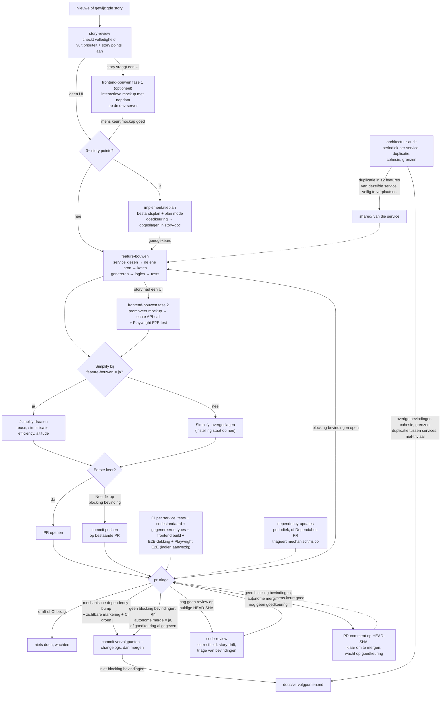

# CLAUDE.md — Contract-first werkwijze

> **Gericht op multi-service applicaties** — meerdere onafhankelijk deploybare services
> (ADR-0002), een Next.js BFF, LLM-orkestratie en async achtergrondtaken.

## Wat dit is

Methodologie voor feature-ontwikkeling in een applicatie die uit meerdere, onafhankelijk
deploybare services bestaat, met een of meer frontends ervoor: **contract-first + vertical
slicing**. Vorm (velden, types) wordt per service op één plek vastgelegd en gegenereerd naar de
rest; gedrag (businessregels) wordt apart, met de hand geschreven. Een feature hoort bij precies
één service; vertical slicing is de indeling *binnen* een service (ADR-0001, ADR-0002).

De werkwijze bestaat uit losse **skills** onder `.claude/skills/`, elk met een eigen trigger
en regel-checklist. Dit bestand is de index — de skills zelf zijn het uitvoerbare document.

De concrete uitwerking — welke services er zijn, wat "de ene bron" is, hoe de generatieketen
heet — is per project vastgelegd in `docs/architectuur/stack-profiel.md` (zie ADR-0004). De
werkwijze zelf is niet aan één stack gebonden; elke skill die zoiets nodig heeft, leest het daar
en neemt het niet aan.

`../voorbeeld/wetsanalyse/` is bedoeld als referentie-implementatie, maar bevat nog geen code —
er staat dus nog geen ingevuld stack-profiel in deze repo, alleen de template met de vragen
(`docs/architectuur/stack-profiel.TEMPLATE.md`).

## Verificatie-principe

Een regel die alleen als tekst in een skill staat, is geen garantie dat hij ook gebeurt — een
stap die geen eigen, zichtbaar spoor achterlaat (tests-groen, generatieketen-actueel, een
`/simplify`-uitkomst, isolatie) kan zonder dat iemand het merkt overgeslagen worden zodra de
rest van het werk al "klaar" aanvoelt.

Daarom, voor elke skill: een stap is pas een echte controle als één van deze waar is —
1. **Een automatische, onafhankelijke check bevestigt het** (bv. CI in
   `.github/workflows/ci.yml`, die tests-groen en generatieketen-actueel al afdwingt zonder op
   zelfrapportage te vertrouwen), of
2. **Een andere skill kan het objectief nakijken** — tegen de diff zelf (bv. `code-review`
   regel 1, die `feature-bouwen`'s regels stuk voor stuk tegen de code aanhoudt), of, als de
   diff het niet laat zien, via een verplichte regel in het commit-/PR-bericht die die andere
   skill controleert (bv. de "Simplify:"-regel, zie `feature-bouwen` regel 9).

Een stap zonder een van beide is geen vangrail, alleen een goede bedoeling. Belangrijke
kanttekening: been 2 in z'n berichtvorm bewijst dat er een regel getypt is, niet dat de
onderliggende actie daadwerkelijk is uitgevoerd — dat is zwakker dan been 1, en geaccepteerd
als de pragmatische ondergrens voor stappen die zich niet automatisch laten verifiëren. Kom je
een gat tegen: voeg een CI-check toe als het deterministisch te verifiëren is, anders een
verplichte regel + een expliciete check in de skill die erna komt.

## Instellingen

- **Autonome merge:** nee <!-- ja | nee -->
  `nee` — `pr-triage` mergt niet zelf; zodra `code-review` niets blocking meer vindt, zet het
  een PR-comment ("klaar om te mergen, wacht op goedkeuring") en wacht op een menselijke
  approve (zie `.claude/skills/pr-triage/SKILL.md` regel 2b). Dit is de enige plek waar dat
  wordt aangegeven — verander het hier, niet in de skill zelf.

- **Simplify bij feature-bouwen:** ja <!-- ja | nee -->
  `ja` — `feature-bouwen` regel 9 draait `/simplify` (vier parallelle subagents) vóór elke
  aflevering. Zet op `nee` om dit uit te zetten (bv. om tokens te besparen bij veel kleine
  wijzigingen) — regel 9 zet dan zelf `Simplify: overgeslagen (instelling staat op nee)` in het
  commit-/PR-bericht in plaats van de check te draaien, zodat het uitzetten zelf zichtbaar en
  controleerbaar blijft.

## Codestandaard

Vorm van de code zelf (opmaak, imports, ongebruikte variabelen) is een geautomatiseerde check,
geen proza-richtlijn — een geschreven stijlgids die niemand afdwingt is hetzelfde
"geen vangrail"-probleem als elders in dit document (§Verificatie-principe).

- **Python:** `ruff` (zie `stack-profiel.md` §Codestandaard voor de exacte config) — lint en format-check.
- **TypeScript:** `eslint` + `prettier` — `npm run lint` en `npm run format:check`.

Beide draaien in CI — dat is been 1 van het Verificatie-principe, dus geen aparte
checklist-regel nodig in `feature-bouwen` of `code-review`. Draai de formatters lokaal vóór je
aflevert om een CI-fail puur op opmaak te voorkomen; dat is gemak, geen verplichte stap.

## Skills

| Skill | Trigger |
|---|---|
| [`story-review`](.claude/skills/story-review/SKILL.md) | Nieuwe of gewijzigde story, vóór er gebouwd wordt. |
| [`implementatieplan`](.claude/skills/implementatieplan/SKILL.md) | **Optioneel** — na `story-review`, vóór `feature-bouwen`. Vertaalt de story naar een concreet bestandsplan (migratie, modellen, endpoints, testcases) en vraagt goedkeuring via plan mode. Gebruik bij 3+ SP of meerdere geraakte bestanden; sla op in de story-doc. |
| [`feature-bouwen`](.claude/skills/feature-bouwen/SKILL.md) | Nieuwe user story, of uitbreiding van bestaand gedrag. |
| [`frontend-bouwen`](.claude/skills/frontend-bouwen/SKILL.md) | **Optioneel** — alleen als de story een UI/scherm vraagt. Fase 1 (mockup) loopt ná `story-review` en vóór `feature-bouwen`; fase 2 (echte data) loopt ná `feature-bouwen` regel 1-6. |
| [`pr-triage`](.claude/skills/pr-triage/SKILL.md) | PR aangemaakt of bijgewerkt — bepaalt of review, verwerken van bevindingen, mergen of niets de volgende stap is. |
| [`code-review`](.claude/skills/code-review/SKILL.md) | `pr-triage` concludeert dat de PR nog geen review op de huidige stand heeft gehad. |
| [`architectuur-audit`](.claude/skills/architectuur-audit/SKILL.md) | Vaste cadans (bv. wekelijks), los van een specifieke feature of PR. |
| [`dependency-updates`](.claude/skills/dependency-updates/SKILL.md) | Vaste cadans (bv. wekelijks), of een open Dependabot-PR. |

Zie elke skill voor de volledige regels, bekende valkuilen en wat de werkwijze niet oplost. De
flowchart hieronder toont de onderlinge volgorde in één oogopslag.

## Flowchart




## Documentatiestructuur

- `docs/architectuur/` — twee soorten inhoud:
  - `c4-model.md` — Context/Container/Component/Code (C4-model); zie de §Bijhouden-sectie
    daar voor wanneer elk niveau bijgewerkt moet worden.
  - `adr/NNNN-<naam>.md` — ADR's: projectbrede technische beslissingen (niet feature-specifiek,
    dat is `docs/stories/`): welke stack, hoe de services zijn afgebakend, welke afwezigheden
    (auth, migraties) en waarom. Eén genummerd bestand per beslissing, kopieer
    `adr/TEMPLATE.md`.
    Een gemaakte, beargumenteerde keuze — geen open punt (dat is `docs/vervolgpunten.md`).
  - `stack-profiel.md` — het projectspecifieke antwoord op de vragen die de skills niet
    hardcoderen: topologie, de ene bron, contractgeneratie, feature-eenheid, dunne verzamelaars,
    migraties, frontend(s), codestandaard. Kopieer de template uit deze repo
    (`werkwijze/docs/architectuur/stack-profiel.TEMPLATE.md`); vereist vóór `feature-bouwen`
    bruikbaar is (zie ADR-0004).
- `docs/stories/TEMPLATE.md` — startpunt voor een nieuwe story (prioriteit `none`, story points
  nog leeg, service in te vullen); kopieer 'm uit deze repo
  (`werkwijze/docs/stories/TEMPLATE.md`) en hernummer, bewerk de template zelf niet.
- `docs/stories/` — user stories + schemabeslissing, inclusief terugverwijzingen naar gedeelde
  modules en de door `story-review` aangevulde prioriteit + story points. Eén document per
  feature, genummerd.
- `docs/vervolgpunten.md` — niet-blocking bevindingen die `pr-triage` (bij het mergen) of
  `architectuur-audit` (direct, ook een dagregel dat de audit gedraaid heeft) hier neerzetten.
- `CHANGELOG.md` — gebruikersgericht, één regel per feature; bugfixes/kleine verbeteringen
  verzameld, pure technische wijzigingen ontbreken. Bijgehouden door `pr-triage`.
- `docs/changelog-technisch.md` — voor AI/team/developers, één regel per gemergde PR zonder
  uitzondering. Bijgehouden door `pr-triage`.

Per service (welke services er zijn, staat in `stack-profiel.md` §Topologie — deze werkwijze
codeert dat niet hard, zie ADR-0002):

- `<service>/app/features/<naam>/` — alles voor die feature: schema, routes, tests.
- `<service>/app/shared/` — modules die door de architectuur-audit (of opportunistisch tijdens
  featurebouw) uit ≥2 features van diezelfde service zijn geëxtraheerd. Gedeelde code tússen
  services loopt hier niet doorheen (ADR-0002).

Per frontend (`stack-profiel.md` §Frontend(s)):

- `<frontend>/generated/` — nooit met de hand bewerken, altijd via de generatieketen
  (`feature-bouwen` regel 4); één gegenereerd bestand per service waarmee de frontend praat.
- `<frontend>/tests/e2e/` — Playwright-E2E-tests, één per UI-feature (`frontend-bouwen` regel 6);
  de aanwezigheid ervan wordt in CI gecontroleerd (`check-frontend-e2e-coverage`), niet alleen
  het slagen van wat er al staat (`test-frontend-e2e`).

## Een nieuw project starten

1. **Vul het stack-profiel in.** Kopieer `docs/architectuur/stack-profiel.TEMPLATE.md` uit deze
   repo naar `docs/architectuur/stack-profiel.md` in je project en beantwoord elke sectie —
   welke services er zijn en waar ze staan, wat "de ene bron" is, of er contractgeneratie is,
   hoe migraties lopen, welke frontends er zijn. Dit is de eerste stap, geen formaliteit
   achteraf: `feature-bouwen` stopt zonder dit bestand (ADR-0004).

2. **Zet CI op, per service.** De werkwijze leunt op been 1 van het Verificatie-principe en
   noemt vier checks bij naam: `check-generated-types`, `check-frontend-e2e-coverage`,
   `check-python-style` en `check-ts-style`, naast de testrun per service. Er wordt in deze repo
   nog geen kant-en-klare workflow meegeleverd — hoe die eruitziet (monorepo-matrix of losse
   workflows per service) is een open punt in `BACKLOG.md` §Core. Tot je die hebt, rust elke
   controle op been 2 (een ander die het nakijkt), wat aantoonbaar zwakker is.

3. **Niets kopiëren.** Zet de agent-root op een workspace-map die zowel deze repo als je nieuwe
   project-repo als sibling bevat:

   ```
   workspace/
     werkwijze-repo/    ← deze repo (werkwijze + voorbeeld/)
     mijn-project/      ← je nieuwe repo
   ```

   Claude Code ontdekt `.claude/skills/` uit elke aanwezige repo zelf en scoped ze automatisch op
   pad (bv. `werkwijze-repo/werkwijze:code-review`) — ook als een andere, niet-verwante repo in
   dezelfde workspace toevallig een skill met dezelfde naam heeft. Kopiëren naar een gedeelde
   `<workspace-root>/.claude/skills/` is niet nodig en kan zo'n naamsbotsing juist veroorzaken.

De skills verwijzen naar paden zonder prefix (`docs/`, en per service/frontend de mappen uit je
stack-profiel) — dat zijn de paden zoals ze in een nieuw project heten, met de project-root als
repo-root.

**Kanttekening voor déze repo:** `voorbeeld/wetsanalyse/` is nog niet uitgebouwd, dus er is nog
geen skelet om te kopiëren en geen voorbeeld van een ingevuld stack-profiel. Zodra dat er wel
is, geldt bovendien dat GitHub Actions en Dependabot uitsluitend `.github/` op de root van een
repository lezen, nooit uit een submap: zolang die referentie-implementatie een submap is,
draait er voor die map geen CI en scant Dependabot niets.
